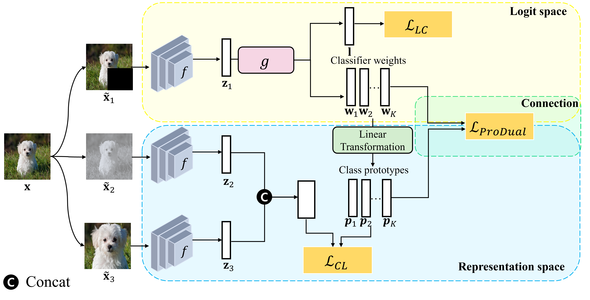

# ProConDual: Class-Prototype based Contrastive learning with promoting Self-Duality for imbalanced image classification

This is a Pytorch implementation of the [ProConDual paper]():

<p align="center">

</p>
 
### ImageNet-LT 
To do supervised training with ProConDual for 180 epochs on ImageNet-LT, run
```
python main_imagenet.py
```
(All default parameter setups are included in main_imagenet.py)


To evaluate the performance on the test set, run
```
python main_imagenet.py  --reload True \
  --resume {model_save_path}
```

| Method | Model | Many | Med | Few | All | model |
| :---:| :---:|:---:|:---:|:---:| :---:|  :---:| 
| ProConDual |ResNeXt-50 | 67.6  | 54.0  | 40.0     | 57.3    | [Download]() |


### ISIC2019 
To do supervised training with ProConDual for 600 epochs on ISIC 2019, run
```
python main_ISIC.py
```
(All default parameter setups are included in main_ISIC.py)

To evaluate the performance on the test set, run
```
python main_ISIC.py  --reload True \
  --resume {model_save_path}
```


| Method | Model | Top-1 Acc(%) | link | 
| :---: | :---: | :---: | :---: | 
|ProConDual | ResNet-50   | 87.18 | [Download]() | 

### Datasets txt file

````
ProConDual-main/dataset
├── ImageNet_LT
|   └── ImageNet_LT_test.txt
|   └── ImageNet_LT_train.txt
|   └── ImageNet_LT_val.txt
└── ISIC2019
    └── ISIC2019_test.csv
    └── ISIC2019_train.csv
    └── ISIC2019_val.csv
````

    
